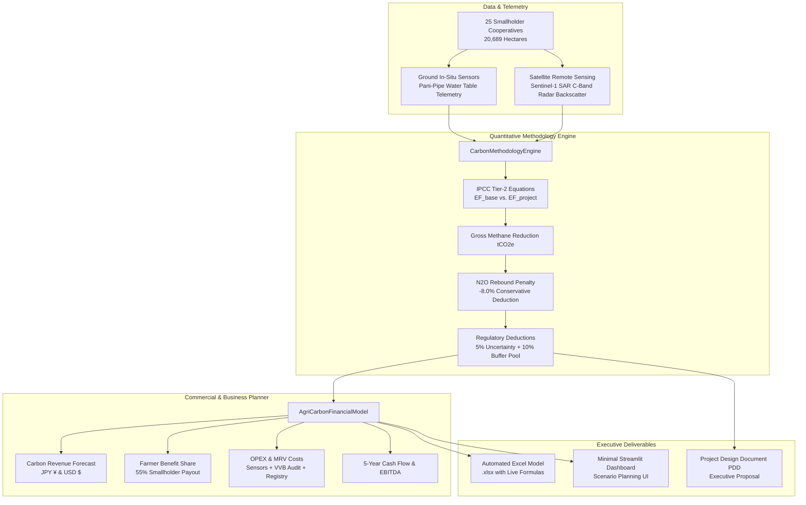

# 🌱 AgriCarbon-MRV: Rice Paddy Carbon Feasibility & Financial Planning Engine

[](https://www.python.org/)
[](https://verra.org/)
[](https://japancredit.go.jp/)
[](https://streamlit.io/)
[](https://github.com/KiskuAryan/agricarbon-mrv)

> **An end-to-end quantitative carbon accounting, MRV (Measurement, Reporting, and Verification), and business feasibility planning engine designed for smallholder agricultural methane abatement (Alternate Wetting and Drying - AWD) across Southeast Asia and India.**
>
> Modeled after high-integrity voluntary and compliance market standards (**Verra VCS CDM AMS-III.AU** and **Japan J-Credit Scheme AG-001**) for agricultural carbon project development, institutional offtake planning, and smallholder benefit-sharing.

---

## 🖥️ Executive Platform Preview

| Interactive Streamlit Planning Engine | Automated OpenPyXL Financial Model |
| :---: | :---: |
|  |  |

---

## 📌 Executive Problem Context

Continuous flooding in irrigated rice paddies creates an anoxic (oxygen-depleted) soil environment where methanogenic bacteria decompose organic biomass, emitting large quantities of **Methane ($\text{CH}_4$)**—a greenhouse gas with **27.9× the global warming potential of $\text{CO}_2$** (IPCC AR6). Globally, rice paddies account for **~8–10% of all agricultural greenhouse gas emissions**.

### The Solution: Alternate Wetting and Drying (AWD)
By allowing the field to dry until the water table drops to 15 cm below the soil surface before re-irrigation:
- **Methane Abatement:** Soil aeration introduces atmospheric oxygen, disrupting methanogenesis and cutting seasonal methane emissions by **35% to 50%**.
- **Water Conservation:** Decreases freshwater irrigation demand by **20% to 30%** without reducing crop yields.
- **$\text{N}_2\text{O}$ Accounting:** Incorporates an explicit **8.0% $\text{N}_2\text{O}$ rebound penalty** to account for temporary soil nitrification during aerobic drydowns.
- **Carbon Monetization:** Generated emission reductions are certified into high-integrity carbon credits ($\text{tCO}_2\text{e}$) sold to corporate buyers (e.g., Japanese corporations seeking Scope 3 / ESG offsets), with 55% of revenues shared directly back to smallholder farmers.

---

## 🏗️ System Architecture



---

## 🔬 Carbon Accounting & MRV Methodology

The engine calculates net certified emission reductions in accordance with **IPCC 2019 Refinement to the 2006 IPCC Guidelines (Volume 4, Chapter 5)** and **Verra CDM AMS-III.AU**:

### 1. Baseline Emissions ($E_{\text{base}}$)
Under traditional continuous flooding across cultivation duration $t$:
$$E_{\text{base}} = EF_c \times SF_w \times SF_p \times SF_o \times t \times \text{Hectares} \times GWP_{\text{CH}_4} \times 10^{-3}$$

- $EF_c = 1.30 \text{ kg }\text{CH}_4\text{/ha/day}$ (IPCC baseline emission factor for Asia)
- $SF_w = 1.00$ (continuous flooding water regime)
- $SF_p = 1.00$ (non-flooded pre-season $>180$ days)
- $SF_o = (1 + \sum ROA_i \times CFOA_i)^{0.59}$ (organic straw amendments factor, $CFOA = 0.14$)
- $GWP_{\text{CH}_4} = 27.9$ (IPCC AR6 100-year metric)

### 2. Project Emissions ($E_{\text{proj}}$)
With verified AWD field drying cycles:
$$E_{\text{proj}} = EF_c \times SF_{w,\text{eff}} \times SF_p \times SF_o \times t \times \text{Hectares} \times GWP_{\text{CH}_4} \times 10^{-3}$$
Where $SF_{w,\text{eff}} = (\text{Compliance} \times 0.52) + ((1 - \text{Compliance}) \times 1.00)$.

### 3. Net Certified Carbon Credits ($\text{Credits}_{\text{issued}}$)
$$\Delta E_{\text{gross}} = E_{\text{base}} - E_{\text{proj}}$$

$$\Delta E_{\text{net}} = \Delta E_{\text{gross}} \times (1 - D_{\text{N2O}})$$

$$\text{Credits}_{\text{issued}} = \Delta E_{\text{net}} \times (1 - D_{\text{unc}}) \times (1 - D_{\text{buf}})$$

Where:
- $D_{\text{N2O}} = 0.08$ (8.0% conservative $\text{N}_2\text{O}$ aerobic rebound deduction)
- $D_{\text{unc}} = 0.05$ (5.0% measurement uncertainty deduction per Verra rules)
- $D_{\text{buf}} = 0.10$ (10.0% non-permanence risk buffer pool reserve)

---

## 📊 Reference Portfolio Case Study (Default Benchmark)

> **Note:** The figures below reflect the included reference portfolio (`data/farm_clusters.csv`, generated with `seed=42` covering 23,015 ha under standard default assumptions: 88% AWD compliance, ¥3,500/tCO₂e, 55% farmer share). Running the interactive Streamlit dashboard (`app.py`) allows real-time dynamic re-computation as sliders are adjusted.

| Metric | Single Season Reference Portfolio (25 Cooperatives) | Unit |
| :--- | :--- | :--- |
| **Aggregated Farm Area** | **23,015** | Hectares (ha) |
| **Participating Smallholders** | **16,387** | Smallholder Families |
| **Gross Methane ($\text{CH}_4$) Avoided** | **1,525.6** | Metric tons $\text{CH}_4$ |
| **Baseline GHG Footprint** | **102,500.6** | $\text{tCO}_2\text{e}$ |
| **Project GHG Footprint (AWD)** | **63,341.2** | $\text{tCO}_2\text{e}$ |
| **Gross GHG Abatement** | **42,564.6** | $\text{tCO}_2\text{e}$ |
| **$\text{N}_2\text{O}$ Rebound Deduction (8%)** | **-3,405.2** | $\text{tCO}_2\text{e}$ |
| **Net Certified Carbon Credits Issued** | **33,285.4** | $\text{tCO}_2\text{e}$ / season |
| **Verified Credit Yield** | **1.45** | $\text{tCO}_2\text{e}$ / ha / season |

---

## 💼 Business Feasibility & Financial Model

The financial model projects commercial cash flows, unit economics, and benefit-sharing:

- **Carbon Price:** ¥3,500 / $\text{tCO}_2\text{e}$ (~$22.58 USD at 155 JPY/USD).
- **Gross Seasonal Revenue:** **JPY 116,498,795 (~$751,605 USD)**.
- **Smallholder Benefit Sharing (55%):** **$413,383 USD** distributed directly to smallholders (~$25.2 USD supplementary cash transfer per farming family per season).
- **MRV & Monitoring Costs:** $4.50/ha ground telemetry + $1.50/ha Sentinel-1 SAR cloud analytics + $3.00/ha local coop management ($207,135 USD).
- **Registry & Audit Fees:** $20,000 fixed VVB validation audit fee + $0.25/credit issuance fee ($28,321 USD).
- **Developer Seasonal EBITDA:** **$102,766 USD (+13.7% margin)**.
- **Annual Developer EBITDA (2 Seasons):** **$205,532 USD / year**.

### 5-Year Scaling Projection

| Horizon | Farm Area (ha) | Annual Credits ($\text{tCO}_2\text{e}$) | Gross Revenue (USD) | Farmer Share (USD) | Net EBITDA (USD) | Cumulative Cash (USD) |
| :--- | :--- | :--- | :--- | :--- | :--- | :--- |
| **Year 1** | 23,015 | 66,570 | $1,503,210 | $826,766 | $205,532 | $205,532 |
| **Year 2** | 41,427 | 119,828 | $2,705,778 | $1,488,179 | $420,816 | $626,348 |
| **Year 3** | 73,648 | 213,026 | $4,810,272 | $2,645,651 | $838,533 | $1,464,881 |
| **Year 4** | 115,075 | 332,854 | $7,516,050 | $4,133,830 | $1,451,481 | $2,916,362 |
| **Year 5** | 172,612 | 499,280 | $11,274,075 | $6,200,745 | $2,389,132 | $5,305,494 |

---

## 🚀 Quickstart & Installation

### 1. Clone & Install Dependencies
```bash
git clone https://github.com/KiskuAryan/agricarbon-mrv.git
cd agricarbon-mrv
pip install -r requirements.txt
```

### 2. Run the Quantitative Engines
```bash
# 1. Generate realistic farm cluster telemetry data
python generate_data.py

# 2. Run the IPCC & Verra methodology engine
python -m src.methodology_engine

# 3. Run the commercial financial model and export Excel workbook
python -m src.financial_model

# 4. Generate the formal Project Design Document (PDD) proposal
python -m src.pdd_generator
```

### 3. Launch the Interactive Scenario Planning Dashboard
```bash
streamlit run app.py
```
Open your browser at `http://localhost:8501` to test credit pricing sensitivity, AWD compliance rates, and export client deliverables.

---

## 📁 Repository Structure

```
agricarbon-mrv/
├── data/
│   └── farm_clusters.csv               # 25 smallholder cooperatives with agronomic telemetry
├── src/
│   ├── methodology_engine.py          # IPCC AR6 & Verra AMS-III.AU calculation engine
│   ├── financial_model.py             # Unit economics & automated multi-tab Excel generator
│   └── pdd_generator.py               # Formal Project Design Document (PDD) generator
├── outputs/
│   ├── AgriCarbon_Financial_Model.xlsx # Professional Excel model with formatted tabs
│   └── PDD_Executive_Proposal.md       # Client-ready PDD methodology brief
├── app.py                             # Clean, minimal 1-page Streamlit executive dashboard
├── generate_data.py                   # Field telemetry & ground pipe sensor simulator
├── requirements.txt                   # Project dependencies
└── README.md                          # Repository documentation
```

---

## 🎯 Industry & Role Alignment: Carbon Business Planning & Methodology
This project demonstrates the core quantitative, commercial, and technical competencies required in the carbon development & climate finance sector:
1. **Methodology Engineering:** Translating complex technical IPCC (Vol 4, Ch 5) and Verra VCS CDM AMS-III.AU protocols into production-grade mathematical algorithms.
2. **Quantitative Analysis & Excel Financial Modeling:** Building multi-tab, audit-ready financial models with automated currency conversions (JPY/USD), variable field OPEX, and smallholder benefit-sharing.
3. **Institutional Documentation:** Drafting client- and auditor-ready Project Design Documents (PDDs), additionality justifications, and executive briefs.
4. **Strategic Business Planning:** Modeling multi-year project scaling trajectories, farmer retention incentives, and developer EBITDA margins.

---

**Author:** Aryan Manjhi (Integrated B.Tech + M.Tech in IT, ABV-IIITM Gwalior)  
**GitHub:** [github.com/KiskuAryan](https://github.com/KiskuAryan)
